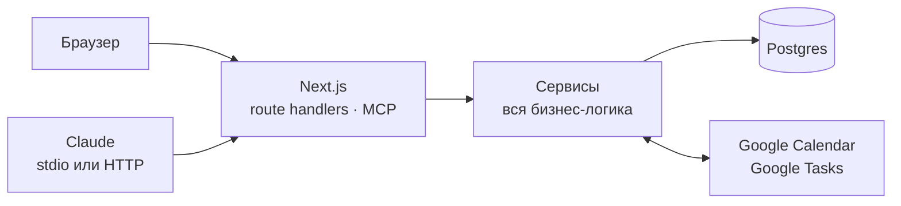

<div align="center">

# WorkFlow

**Канбан-доски и календари всех Google-аккаунтов в одном окне.
И тем и другим управляет Claude.**


</div>

---

Личный менеджер задач на одного человека. Слева — календарь, сведённый из нескольких
Google-аккаунтов, справа — сразу две канбан-доски. Ничего не синхронизируется с чужими
серверами: база поднимается в Docker рядом, вложения лежат на диске, наружу уходят только
запросы к Google за вашими же событиями.

Второй интерфейс к тому же самому — Claude через MCP. «Что у меня сегодня», «перенеси
карточку в работу», «поставь встречу на четверг в три» — не переключаясь в браузер.

## Что умеет

**Доски.** Колонки, карточки, метки, чек-листы, сроки, вложения. Порядок карточек —
дробные строковые ранги: перемещение внутри колонки на тысячу карточек стоит один `UPDATE`
одной строки. Перетаскивание мышью, перенос между досками, мягкий архив. Импорт доски из
экспорта Trello.

**Календарь.** Несколько Google-аккаунтов сразу, сетка дня и недели, события на весь день
отдельной полосой. Правки ходят в обе стороны: сделанное в Google приезжает меньше чем за
минуту при открытом окне, сделанное здесь уезжает туда сразу. Конкурентная правка ловится
через `If-Match` и не затирается молча.

**Задачи Google.** Списки и задачи всех аккаунтов приезжают наравне с событиями. Задача со
сроком видна полосой, чекбокс на ней закрывает её и в Google.

**Тайм-блоки.** Карточка с доски раскладывается по сетке дня как отведённое под неё время,
с необязательным зеркалом в Google-календаре.

**Claude через MCP.** Тринадцать инструментов поверх тех же сервисов, что и у браузера:
доски, карточки, поиск, события и составной `plan_day` — весь день одним вызовом.

## Как устроено



Ключевое правило: бизнес-логика живёт только в `src/server/services`. Route handler и
MCP-инструмент делают три вещи — разбирают вход, зовут сервис, сериализуют ответ. Поэтому
браузер и Claude не могут разойтись в поведении: перемещение карточки у них буквально одно
и то же.

| Слой | Чем сделан |
|---|---|
| Интерфейс | Next.js 16 (App Router), React 19, Tailwind 4, Radix UI, dnd-kit |
| Данные | Postgres 16, Drizzle ORM, миграции из схемы |
| Google | OAuth 2.0, инкрементальная синхронизация по `syncToken`, Tasks — догон по `updatedMin` |
| Claude | MCP поверх stdio и Streamable HTTP |
| Проверки | Vitest на сервисы, Playwright на дымовой сценарий |

Время в базе — `timestamptz` в UTC, показывается в `Europe/Moscow`. События на весь день
хранятся датами и через часовые пояса не проходят вовсе — иначе уезжают на сутки.

## Что нужно

- **Node 22.18 или новее.** Скрипты запускаются как `.ts` без сборки — нужна
  версия, умеющая это сама. Проверено на 22.22.
- **pnpm** (в репозитории закреплён `pnpm@11`).
- **Docker** — под Postgres.
- **Аккаунт Google** и доступ к [Google Cloud Console](https://console.cloud.google.com/).

## Установка

### 1. Приложение в Google Cloud

Это самая долгая часть, и обойти её нельзя: без своего OAuth-клиента приложение не увидит
ни одного календаря.

1. Завести проект в Google Cloud Console, включить **Google Calendar API** и
   **Google Tasks API**.
2. Заполнить экран согласия. Тип — «External».
3. **Сразу перевести приложение в статус «In production».** В статусе «Testing»
   refresh-токен умирает ровно через семь дней, и выглядит это как случайная поломка
   синхронизации, а не как истёкшее разрешение.
4. Кнопка `Publish app` не нажмётся, пока в разделе Branding не заполнены публичные адреса
   домашней страницы и политики конфиденциальности. Подойдут любые две живые https-страницы,
   которыми вы владеете, — например, на GitHub Pages.
5. Создать OAuth-клиент типа **Web application** с redirect URI
   `http://localhost:3000/api/auth/google/callback` — ровно тем, что попадёт в
   `GOOGLE_REDIRECT_URI`, до символа.

Пока приложение не прошло верификацию Google, на экране согласия будет предупреждение
«Google не проверил это приложение». Для своего аккаунта это нормально: жмёте
«Дополнительные настройки» → «Перейти».

### 2. Окружение

```bash
git clone https://github.com/ev-climb/workflow.git
cd workflow
pnpm install
cp .env.example .env
```

Все переменные с пояснениями перечислены в [`.env.example`](.env.example) — он и есть
источник истины. Две из них считаются командами:

```bash
openssl rand -base64 32   # APP_ENCRYPTION_KEY — шифрует токены Google в базе
pnpm auth:hash            # APP_PASSWORD_HASH  — пароль читается со stdin, в историю не попадает
```

Ключ шифрования держите в менеджере паролей: с его потерей все подключённые аккаунты
придётся подключать заново. Значения в `.env` не берутся в кавычки, и `$` в них
недопустим — Next раскроет его как подстановку другой переменной.

### 3. База и запуск

```bash
docker compose up -d db   # Postgres на порту из POSTGRES_PORT
pnpm db:migrate           # накатить схему
pnpm dev                  # http://localhost:3000
```

Войти паролем, который вы захешировали, — и на `/settings` подключить Google-аккаунты по
OAuth. Каждый следующий аккаунт добавляется там же и получает свой цвет; календарь внутри
аккаунта может этот цвет перебить.

### 4. Перенос из Trello (необязательно)

<details>
<summary>Как выгрузить доску и залить её сюда</summary>

В Trello: доска → меню → «Ещё» → «Print, export, and share» → «Export as JSON». Затем:

```bash
pnpm import:trello ~/Downloads/board.json
```

Переносятся списки, карточки, метки, чек-листы, сроки и порядок карточек. Архивные списки
и карточки приезжают уже архивными. Повторный импорт того же файла доску не задваивает:
идентификатор Trello запоминается, и второй заход останавливается с ошибкой.

</details>

## Подключение к Claude

Два транспорта, и разница между ними не только в настройке.

### stdio — для Claude Desktop

```json
{
  "mcpServers": {
    "workflow": {
      "command": "pnpm",
      "args": ["-C", "/абсолютный/путь/к/workflow", "mcp:stdio"]
    }
  }
}
```

Проверить, что сервер вообще отвечает, можно и без клиента:

```bash
pnpm mcp:stdio   # ждёт JSON-RPC на stdin; Ctrl-C — выход
```

### HTTP — для Claude Code и всего остального

Задайте в `.env` переменную `MCP_BEARER_TOKEN` (любая длинная случайная строка) и
поднимите приложение. Затем:

```bash
claude mcp add --transport http workflow http://localhost:3000/api/mcp \
  --header "Authorization: Bearer ваш-токен"
```

Пока `MCP_BEARER_TOKEN` пуст, эндпоинта не существует — он отвечает 404, а не работает без
проверки. С неверным токеном — 401.

> **Какой транспорт выбрать.** По HTTP запросы идут внутрь того же процесса, что отдаёт
> интерфейс, поэтому правка, сделанная Claude, тут же прилетает в открытую вкладку. По
> stdio сервер поднимается отдельным процессом, шина событий у него своя, и открытая
> вкладка о правке не узнает до следующего обновления. Работает и то и другое; освежается
> само — только по HTTP.

### Инструменты

| Инструмент | Что делает |
|---|---|
| `list_boards` | Доски одним списком |
| `get_board` | Колонки с карточками: метки, сроки, прогресс чек-листов. Без описаний |
| `get_card` | Одна карточка целиком |
| `search_cards` | Поиск по тексту, метке, сроку, доске |
| `create_card` | Карточка в колонку; строка вида `Починить пуши !пятница #баг` разбирается на срок и метку |
| `update_card` | Заголовок, описание, срок, метки |
| `move_card` | Другая колонка и позиция относительно соседа |
| `archive_card` | Мягкий архив |
| `add_checklist_item` | Пункт чек-листа и отметка выполнения |
| `list_events` | События всех видимых календарей в окне дат |
| `create_event` | Событие в выбранном календаре |
| `update_event` | Время, название, описание |
| `plan_day` | Весь день одним вызовом: события, тайм-блоки, ближайшие сроки, рабочие колонки обеих досок |

Ответы намеренно скупые: доска на сотню карточек укладывается в единицы тысяч токенов, а
описания карточек в списках не отдаются вовсе — за ними идут отдельным вызовом.

## Команды

| Команда | Что делает |
|---|---|
| `pnpm dev` | Приложение на `localhost:3000` |
| `pnpm typecheck` | `tsc --noEmit` |
| `pnpm test` | Юнит-тесты сервисов (Vitest) |
| `pnpm test:e2e` | Дымовой сценарий (Playwright) |
| `pnpm db:generate` | Сгенерировать миграцию после правки схемы |
| `pnpm db:migrate` | Накатить миграции |
| `pnpm db:studio` | Посмотреть данные глазами |
| `pnpm auth:hash` | Хеш пароля для `APP_PASSWORD_HASH` |
| `pnpm import:trello` | Импорт доски из экспорта Trello |
| `pnpm mcp:stdio` | MCP-сервер поверх stdio |

Тесты ходят в отдельную базу — ту же, но с суффиксом `_test`. Совпадение её адреса с
рабочим считается ошибкой и роняет прогон: тесты чистят таблицы целиком.

## Раскладка

```
src/
  app/
    (workspace)/     рабочий стол: календарь слева, две доски справа
    api/             route handlers, среди них mcp/ и auth/google/
  server/
    db/              схема, клиент, миграции
    services/        вся бизнес-логика
    google/          OAuth, синхронизация, маппинг событий
    mcp/             определения инструментов — обёртки над сервисами
  components/
  lib/
bin/mcp-stdio.ts     точка входа MCP для Claude Desktop
```

## Границы

Честно о том, чего здесь нет и не будет.

- **Пользователь ровно один.** Ни регистрации, ни ролей, ни совместной работы: вход —
  один пароль из переменной окружения. Это ядро экономии в проекте, а не незаконченность.
- **Синхронизация опросом, а не webhooks.** Локально нет входящего HTTPS, поэтому раз в
  минуту при открытом окне и раз в десять минут, когда никто не смотрит.
- **Серию повторяющихся событий править нельзя** — только отдельные вхождения. Правила
  повторения заводятся в Google, ссылка на серию есть в карточке события.
- **Вложения лежат на диске сервера** и бэкапятся вместе с ним, а не в облаке.
- **Мобильного приложения нет.** Мобильный сценарий закрывает сам Google Calendar.
- Нет комментариев, ленты активности, уведомлений, шаблонов досок, автоматизаций и Гантта.

## Лицензия

Личный проект, публичный ради требований Google к экрану согласия. Берите что пригодится.
